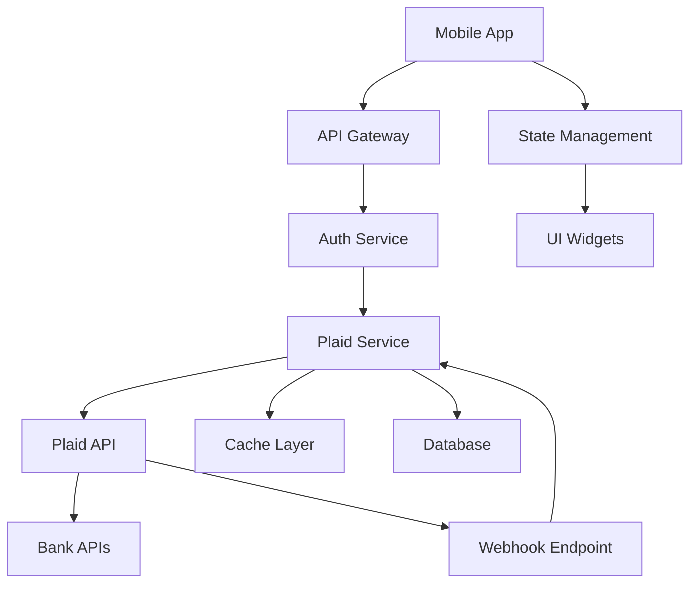

# Plaid API Integration Matrix & Widget Design System

## Table of Contents
1. [Plaid API Endpoints Matrix](#plaid-api-endpoints-matrix)
2. [Widget Component Mapping](#widget-component-mapping)
3. [Data Flow Architecture](#data-flow-architecture)
4. [Implementation Examples](#implementation-examples)
5. [Testing Strategy](#testing-strategy)
6. [Security Considerations](#security-considerations)

---

## Plaid API Endpoints Matrix

### Core Banking APIs

| API Category | Endpoint | HTTP Method | Required Parameters | Rate Limit | Webhook Events |
|-------------|----------|-------------|-------------------|------------|----------------|
| **Auth** | `/auth/get` | POST | `access_token`, `client_id`, `secret` | 100/min | `DEFAULT_UPDATE` |
| **Transactions** | `/transactions/get` | POST | `access_token`, `start_date`, `end_date` | 100/min | `DEFAULT_UPDATE`, `HISTORICAL_UPDATE` |
| **Balance** | `/accounts/balance/get` | POST | `access_token`, `client_id`, `secret` | 100/min | `DEFAULT_UPDATE` |
| **Identity** | `/identity/get` | POST | `access_token`, `client_id`, `secret` | 100/min | `DEFAULT_UPDATE` |
| **Assets** | `/assets/report/create` | POST | `access_token`, `days_requested` | 25/min | `ASSETS_PRODUCT_READY` |
| **Investments** | `/investments/holdings/get` | POST | `access_token`, `client_id`, `secret` | 100/min | `HOLDINGS` |
| **Liabilities** | `/liabilities/get` | POST | `access_token`, `client_id`, `secret` | 100/min | `DEFAULT_UPDATE` |
| **Payment Init** | `/payment_initiation/payment/create` | POST | `recipient_id`, `reference`, `amount` | 25/min | `PAYMENT_STATUS_UPDATE` |

### Extended APIs

| API Category | Endpoint | HTTP Method | Purpose | Response Schema |
|-------------|----------|-------------|---------|----------------|
| **Accounts** | `/accounts/get` | POST | Get account metadata | `Account[]` |
| **Categories** | `/categories/get` | POST | Transaction categories | `Category[]` |
| **Institutions** | `/institutions/get` | POST | Financial institution data | `Institution[]` |
| **Item** | `/item/get` | POST | Item metadata | `Item` |
| **Link Token** | `/link/token/create` | POST | Generate Link token | `LinkToken` |
| **Processor** | `/processor/token/create` | POST | Create processor token | `ProcessorToken` |

### Error Codes & Handling

| Error Type | HTTP Code | Plaid Code | Description | Handling Strategy |
|-----------|-----------|------------|-------------|------------------|
| `INVALID_REQUEST` | 400 | Various | Malformed request | Validate input parameters |
| `INVALID_RESULT` | 400 | Various | Invalid response data | Retry with backoff |
| `INVALID_INPUT` | 400 | Various | Invalid input parameters | Show user-friendly error |
| `INSTITUTION_ERROR` | 400 | Various | Bank-side issues | Show maintenance message |
| `RATE_LIMIT_EXCEEDED` | 429 | Various | Too many requests | Implement exponential backoff |
| `ITEM_ERROR` | 400 | `ITEM_LOGIN_REQUIRED` | Re-authentication needed | Trigger Link update mode |

---

## Widget Component Mapping

### Material Design 3 Components for Financial Data

#### Account Balance Display

```yaml
Data Type: AccountBalance
Material Component: Card + ListTile
Widget Structure:
  - Container: Card (elevation: 2)
  - Header: Account name + institution
  - Body: Balance amount (styled typography)
  - Footer: Last updated timestamp
```

**Flutter Implementation:**
```dart
class AccountBalanceWidget extends StatelessWidget {
  final Account account;
  
  @override
  Widget build(BuildContext context) {
    return Card(
      elevation: 2,
      child: ListTile(
        leading: CircleAvatar(
          backgroundColor: Theme.of(context).colorScheme.primaryContainer,
          child: Icon(Icons.account_balance),
        ),
        title: Text(
          account.name,
          style: Theme.of(context).textTheme.titleMedium,
        ),
        subtitle: Text(account.officialName ?? account.subtype),
        trailing: Column(
          crossAxisAlignment: CrossAxisAlignment.end,
          children: [
            Text(
              NumberFormat.currency(symbol: '\$').format(account.balances.current),
              style: Theme.of(context).textTheme.titleLarge?.copyWith(
                fontWeight: FontWeight.bold,
              ),
            ),
            Text(
              'Available: ${NumberFormat.currency(symbol: '\$').format(account.balances.available)}',
              style: Theme.of(context).textTheme.bodySmall,
            ),
          ],
        ),
      ),
    );
  }
}
```

#### Transaction List Display

```yaml
Data Type: Transaction[]
Material Component: ListView + ExpansionTile
Widget Structure:
  - Container: ListView.separated
  - Item: ExpansionTile with transaction summary
  - Details: Expandable section with metadata
```

**Flutter Implementation:**
```dart
class TransactionListWidget extends StatelessWidget {
  final List<Transaction> transactions;
  
  @override
  Widget build(BuildContext context) {
    return ListView.separated(
      itemCount: transactions.length,
      separatorBuilder: (context, index) => const Divider(height: 1),
      itemBuilder: (context, index) {
        final transaction = transactions[index];
        return ExpansionTile(
          leading: _getTransactionIcon(transaction.category),
          title: Text(
            transaction.merchantName ?? transaction.name,
            style: Theme.of(context).textTheme.titleMedium,
          ),
          subtitle: Text(
            '${transaction.category?.join(' > ')} • ${_formatDate(transaction.date)}',
            style: Theme.of(context).textTheme.bodySmall,
          ),
          trailing: Text(
            NumberFormat.currency(symbol: '\$').format(-transaction.amount),
            style: Theme.of(context).textTheme.titleMedium?.copyWith(
              color: transaction.amount > 0 
                ? Colors.red 
                : Colors.green,
              fontWeight: FontWeight.bold,
            ),
          ),
          children: [
            Padding(
              padding: const EdgeInsets.all(16.0),
              child: _buildTransactionDetails(transaction),
            ),
          ],
        );
      },
    );
  }
}
```

#### Investment Holdings Dashboard

```yaml
Data Type: InvestmentHolding[]
Material Component: GridView + Card
Widget Structure:
  - Container: GridView.builder
  - Item: Card with holding summary
  - Details: Performance metrics and allocation
```

### Responsive Design Specifications

| Screen Size | Layout | Widget Behavior |
|------------|--------|----------------|
| Mobile (< 600dp) | Single column, stacked cards | Full-width components |
| Tablet (600-840dp) | Two-column grid | Adaptive card sizing |
| Desktop (> 840dp) | Multi-column dashboard | Fixed-width sidebar + content |

### State Management Patterns

#### BLoC Pattern for Plaid Data

```dart
// Events
abstract class PlaidEvent {}
class LoadAccountsEvent extends PlaidEvent {}
class LoadTransactionsEvent extends PlaidEvent {
  final String accountId;
  final DateTime startDate;
  final DateTime endDate;
}
class RefreshDataEvent extends PlaidEvent {}

// States
abstract class PlaidState {}
class PlaidLoadingState extends PlaidState {}
class PlaidLoadedState extends PlaidState {
  final List<Account> accounts;
  final List<Transaction> transactions;
}
class PlaidErrorState extends PlaidState {
  final String message;
}

// BLoC
class PlaidBloc extends Bloc<PlaidEvent, PlaidState> {
  final PlaidRepository repository;
  
  PlaidBloc({required this.repository}) : super(PlaidLoadingState()) {
    on<LoadAccountsEvent>(_onLoadAccounts);
    on<LoadTransactionsEvent>(_onLoadTransactions);
    on<RefreshDataEvent>(_onRefreshData);
  }
  
  Future<void> _onLoadAccounts(LoadAccountsEvent event, Emitter<PlaidState> emit) async {
    try {
      emit(PlaidLoadingState());
      final accounts = await repository.getAccounts();
      emit(PlaidLoadedState(accounts: accounts, transactions: []));
    } catch (e) {
      emit(PlaidErrorState(message: e.toString()));
    }
  }
}
```

---

## Data Flow Architecture

### High-Level Data Flow



### Service Architecture

```dart
// Repository Pattern
abstract class PlaidRepository {
  Future<List<Account>> getAccounts();
  Future<List<Transaction>> getTransactions(String accountId, DateTime start, DateTime end);
  Future<Identity> getIdentity();
  Future<List<InvestmentHolding>> getHoldings();
}

class PlaidRepositoryImpl implements PlaidRepository {
  final PlaidApiClient apiClient;
  final CacheManager cache;
  
  PlaidRepositoryImpl({
    required this.apiClient,
    required this.cache,
  });
  
  @override
  Future<List<Account>> getAccounts() async {
    // Check cache first
    final cachedAccounts = await cache.get('accounts');
    if (cachedAccounts != null && !_isExpired(cachedAccounts)) {
      return cachedAccounts;
    }
    
    // Fetch from API
    final accounts = await apiClient.getAccounts();
    await cache.set('accounts', accounts, duration: Duration(minutes: 5));
    return accounts;
  }
}

// API Client
class PlaidApiClient {
  final Dio dio;
  final String baseUrl;
  final String clientId;
  final String secret;
  
  Future<List<Account>> getAccounts() async {
    final response = await dio.post(
      '$baseUrl/accounts/get',
      data: {
        'client_id': clientId,
        'secret': secret,
        'access_token': await _getAccessToken(),
      },
    );
    
    return (response.data['accounts'] as List)
        .map((json) => Account.fromJson(json))
        .toList();
  }
}
```

### Real-time Updates via Webhooks

```dart
class WebhookHandler {
  final PlaidBloc plaidBloc;
  
  void handleWebhook(Map<String, dynamic> payload) {
    final webhookType = payload['webhook_type'];
    final webhookCode = payload['webhook_code'];
    
    switch (webhookType) {
      case 'TRANSACTIONS':
        _handleTransactionUpdate(webhookCode, payload);
        break;
      case 'HOLDINGS':
        _handleHoldingsUpdate(webhookCode, payload);
        break;
      case 'ITEM':
        _handleItemUpdate(webhookCode, payload);
        break;
    }
  }
  
  void _handleTransactionUpdate(String code, Map<String, dynamic> payload) {
    switch (code) {
      case 'DEFAULT_UPDATE':
      case 'HISTORICAL_UPDATE':
        plaidBloc.add(RefreshDataEvent());
        break;
      case 'TRANSACTIONS_REMOVED':
        plaidBloc.add(RemoveTransactionsEvent(
          removedTransactions: payload['removed_transactions'],
        ));
        break;
    }
  }
}
```

---

## Implementation Examples

### Complete Account Dashboard

```dart
class AccountDashboard extends StatefulWidget {
  @override
  _AccountDashboardState createState() => _AccountDashboardState();
}

class _AccountDashboardState extends State<AccountDashboard> {
  late PlaidBloc _plaidBloc;
  
  @override
  void initState() {
    super.initState();
    _plaidBloc = context.read<PlaidBloc>();
    _plaidBloc.add(LoadAccountsEvent());
  }
  
  @override
  Widget build(BuildContext context) {
    return Scaffold(
      appBar: AppBar(
        title: Text('My Accounts'),
        actions: [
          IconButton(
            icon: Icon(Icons.refresh),
            onPressed: () => _plaidBloc.add(RefreshDataEvent()),
          ),
        ],
      ),
      body: BlocBuilder<PlaidBloc, PlaidState>(
        builder: (context, state) {
          if (state is PlaidLoadingState) {
            return _buildLoadingState();
          } else if (state is PlaidLoadedState) {
            return _buildLoadedState(state);
          } else if (state is PlaidErrorState) {
            return _buildErrorState(state);
          }
          return Container();
        },
      ),
    );
  }
  
  Widget _buildLoadingState() {
    return Center(
      child: Column(
        mainAxisAlignment: MainAxisAlignment.center,
        children: [
          CircularProgressIndicator(),
          SizedBox(height: 16),
          Text('Loading your financial data...'),
        ],
      ),
    );
  }
  
  Widget _buildLoadedState(PlaidLoadedState state) {
    return RefreshIndicator(
      onRefresh: () async {
        _plaidBloc.add(RefreshDataEvent());
      },
      child: CustomScrollView(
        slivers: [
          SliverToBoxAdapter(
            child: _buildAccountSummary(state.accounts),
          ),
          SliverList(
            delegate: SliverChildBuilderDelegate(
              (context, index) {
                return AccountBalanceWidget(account: state.accounts[index]);
              },
              childCount: state.accounts.length,
            ),
          ),
        ],
      ),
    );
  }
  
  Widget _buildErrorState(PlaidErrorState state) {
    return Center(
      child: Column(
        mainAxisAlignment: MainAxisAlignment.center,
        children: [
          Icon(Icons.error_outline, size: 64, color: Colors.red),
          SizedBox(height: 16),
          Text(
            'Failed to load data',
            style: Theme.of(context).textTheme.titleLarge,
          ),
          SizedBox(height: 8),
          Text(
            state.message,
            textAlign: TextAlign.center,
            style: Theme.of(context).textTheme.bodyMedium,
          ),
          SizedBox(height: 16),
          ElevatedButton(
            onPressed: () => _plaidBloc.add(LoadAccountsEvent()),
            child: Text('Retry'),
          ),
        ],
      ),
    );
  }
  
  Widget _buildAccountSummary(List<Account> accounts) {
    final totalBalance = accounts.fold<double>(
      0.0,
      (sum, account) => sum + (account.balances.current ?? 0),
    );
    
    return Card(
      margin: EdgeInsets.all(16),
      child: Padding(
        padding: EdgeInsets.all(20),
        child: Column(
          crossAxisAlignment: CrossAxisAlignment.start,
          children: [
            Text(
              'Total Balance',
              style: Theme.of(context).textTheme.titleMedium,
            ),
            SizedBox(height: 8),
            Text(
              NumberFormat.currency(symbol: '\$').format(totalBalance),
              style: Theme.of(context).textTheme.headlineMedium?.copyWith(
                fontWeight: FontWeight.bold,
                color: Theme.of(context).colorScheme.primary,
              ),
            ),
            SizedBox(height: 16),
            Row(
              mainAxisAlignment: MainAxisAlignment.spaceAround,
              children: [
                _buildSummaryItem(
                  'Accounts',
                  accounts.length.toString(),
                  Icons.account_balance,
                ),
                _buildSummaryItem(
                  'Banks',
                  accounts.map((a) => a.institutionId).toSet().length.toString(),
                  Icons.business,
                ),
              ],
            ),
          ],
        ),
      ),
    );
  }
}
```

### Transaction Search & Filter

```dart
class TransactionSearchDelegate extends SearchDelegate<Transaction?> {
  final List<Transaction> transactions;
  final PlaidBloc plaidBloc;
  
  TransactionSearchDelegate({
    required this.transactions,
    required this.plaidBloc,
  });
  
  @override
  List<Widget> buildActions(BuildContext context) {
    return [
      IconButton(
        icon: Icon(Icons.clear),
        onPressed: () => query = '',
      ),
      IconButton(
        icon: Icon(Icons.filter_list),
        onPressed: () => _showFilterDialog(context),
      ),
    ];
  }
  
  @override
  Widget buildLeading(BuildContext context) {
    return IconButton(
      icon: Icon(Icons.arrow_back),
      onPressed: () => close(context, null),
    );
  }
  
  @override
  Widget buildResults(BuildContext context) {
    final filteredTransactions = transactions.where((transaction) {
      final searchLower = query.toLowerCase();
      return transaction.name.toLowerCase().contains(searchLower) ||
             (transaction.merchantName?.toLowerCase().contains(searchLower) ?? false) ||
             transaction.category?.any((cat) => cat.toLowerCase().contains(searchLower)) == true;
    }).toList();
    
    return TransactionListWidget(transactions: filteredTransactions);
  }
  
  @override
  Widget buildSuggestions(BuildContext context) {
    if (query.isEmpty) {
      return _buildRecentSearches();
    }
    
    return buildResults(context);
  }
}
```

---

## Testing Strategy

### Sandbox Environment Setup

```dart
class PlaidTestConfig {
  static const String sandboxBaseUrl = 'https://sandbox.plaid.com';
  static const String productionBaseUrl = 'https://production.plaid.com';
  static const String developmentBaseUrl = 'https://development.plaid.com';
  
  static String get baseUrl {
    switch (Environment.current) {
      case Environment.sandbox:
        return sandboxBaseUrl;
      case Environment.development:
        return developmentBaseUrl;
      case Environment.production:
        return productionBaseUrl;
    }
  }
  
  // Sandbox test credentials
  static const Map<String, String> sandboxCredentials = {
    'good_auth': 'user_good',
    'bad_auth': 'user_bad',
    'locked_account': 'user_locked',
    'invalid_credentials': 'user_bad',
  };
}
```

### Mock Data Structures

```dart
class MockPlaidData {
  static List<Account> mockAccounts() {
    return [
      Account(
        accountId: 'test_account_1',
        name: 'Plaid Checking',
        officialName: 'Plaid Gold Standard 0% Interest Checking',
        type: 'depository',
        subtype: 'checking',
        balances: AccountBalance(
          current: 1234.56,
          available: 1134.56,
          isoCurrencyCode: 'USD',
        ),
        mask: '0000',
        institutionId: 'ins_test',
      ),
      Account(
        accountId: 'test_account_2',
        name: 'Plaid Saving',
        officialName: 'Plaid Silver Standard 0.1% Interest Saving',
        type: 'depository',
        subtype: 'savings',
        balances: AccountBalance(
          current: 5432.10,
          available: 5432.10,
          isoCurrencyCode: 'USD',
        ),
        mask: '1111',
        institutionId: 'ins_test',
      ),
    ];
  }
  
  static List<Transaction> mockTransactions() {
    return [
      Transaction(
        transactionId: 'test_transaction_1',
        accountId: 'test_account_1',
        amount: 12.34,
        isoCurrencyCode: 'USD',
        date: DateTime.now().subtract(Duration(days: 1)),
        name: 'STARBUCKS STORE 12345',
        merchantName: 'Starbucks',
        category: ['Food and Drink', 'Restaurants', 'Coffee Shop'],
        location: TransactionLocation(
          address: '123 Main St',
          city: 'Seattle',
          region: 'WA',
          postalCode: '98101',
          country: 'US',
        ),
        paymentMeta: PaymentMeta(
          referenceNumber: 'REF123',
          ppdId: 'PPD456',
        ),
      ),
    ];
  }
}
```

### Widget Testing Patterns

```dart
void main() {
  group('AccountBalanceWidget Tests', () {
    testWidgets('displays account information correctly', (WidgetTester tester) async {
      // Arrange
      final mockAccount = MockPlaidData.mockAccounts().first;
      
      // Act
      await tester.pumpWidget(
        MaterialApp(
          home: Scaffold(
            body: AccountBalanceWidget(account: mockAccount),
          ),
        ),
      );
      
      // Assert
      expect(find.text('Plaid Checking'), findsOneWidget);
      expect(find.text('\$1,234.56'), findsOneWidget);
      expect(find.text('Available: \$1,134.56'), findsOneWidget);
    });
    
    testWidgets('handles null available balance', (WidgetTester tester) async {
      // Arrange
      final mockAccount = MockPlaidData.mockAccounts().first.copyWith(
        balances: AccountBalance(
          current: 1000.0,
          available: null,
          isoCurrencyCode: 'USD',
        ),
      );
      
      // Act
      await tester.pumpWidget(
        MaterialApp(
          home: Scaffold(
            body: AccountBalanceWidget(account: mockAccount),
          ),
        ),
      );
      
      // Assert
      expect(find.text('Available: --'), findsOneWidget);
    });
  });
  
  group('PlaidBloc Tests', () {
    late MockPlaidRepository mockRepository;
    late PlaidBloc plaidBloc;
    
    setUp(() {
      mockRepository = MockPlaidRepository();
      plaidBloc = PlaidBloc(repository: mockRepository);
    });
    
    tearDown(() {
      plaidBloc.close();
    });
    
    blocTest<PlaidBloc, PlaidState>(
      'emits [PlaidLoadingState, PlaidLoadedState] when LoadAccountsEvent is successful',
      build: () {
        when(() => mockRepository.getAccounts())
            .thenAnswer((_) async => MockPlaidData.mockAccounts());
        return plaidBloc;
      },
      act: (bloc) => bloc.add(LoadAccountsEvent()),
      expect: () => [
        isA<PlaidLoadingState>(),
        isA<PlaidLoadedState>(),
      ],
    );
    
    blocTest<PlaidBloc, PlaidState>(
      'emits [PlaidLoadingState, PlaidErrorState] when LoadAccountsEvent fails',
      build: () {
        when(() => mockRepository.getAccounts())
            .thenThrow(Exception('Network error'));
        return plaidBloc;
      },
      act: (bloc) => bloc.add(LoadAccountsEvent()),
      expect: () => [
        isA<PlaidLoadingState>(),
        isA<PlaidErrorState>(),
      ],
    );
  });
}
```

### Integration Testing

```dart
void main() {
  group('Plaid Integration Tests', () {
    late PlaidApiClient client;
    
    setUpAll(() {
      client = PlaidApiClient(
        baseUrl: PlaidTestConfig.sandboxBaseUrl,
        clientId: 'test_client_id',
        secret: 'test_secret',
      );
    });
    
    testWidgets('end-to-end account loading flow', (WidgetTester tester) async {
      // Create app with real Plaid integration
      await tester.pumpWidget(
        MaterialApp(
          home: BlocProvider(
            create: (context) => PlaidBloc(
              repository: PlaidRepositoryImpl(
                apiClient: client,
                cache: MemoryCache(),
              ),
            ),
            child: AccountDashboard(),
          ),
        ),
      );
      
      // Verify loading state
      expect(find.byType(CircularProgressIndicator), findsOneWidget);
      
      // Wait for data to load
      await tester.pumpAndSettle();
      
      // Verify accounts are displayed
      expect(find.byType(AccountBalanceWidget), findsWidgets);
      expect(find.text('Total Balance'), findsOneWidget);
    });
  });
}
```

---

## Security Considerations

### Data Classification & Handling

| Data Type | Classification | Storage Requirements | Transmission |
|-----------|---------------|---------------------|--------------|
| Account Numbers | PII - Confidential | Encrypted at rest, tokenized | HTTPS + Certificate Pinning |
| Transaction Data | PII - Confidential | Encrypted at rest, 90-day retention | HTTPS + Certificate Pinning |
| Balance Information | PII - Confidential | Encrypted at rest, cached max 5min | HTTPS + Certificate Pinning |
| Access Tokens | Authentication - Restricted | Encrypted, secure storage, rotated | HTTPS + Certificate Pinning |
| Identity Data | PII - Confidential | Encrypted at rest, minimal retention | HTTPS + Certificate Pinning |

### Implementation Security Patterns

```dart
class SecurePlaidClient extends PlaidApiClient {
  final SecureStorage secureStorage;
  final CertificatePinner certificatePinner;
  
  SecurePlaidClient({
    required super.baseUrl,
    required super.clientId,
    required super.secret,
    required this.secureStorage,
    required this.certificatePinner,
  }) {
    // Configure Dio with security interceptors
    dio.interceptors.addAll([
      CertificatePinningInterceptor(certificatePinner),
      AuthInterceptor(secureStorage),
      LoggingInterceptor(level: Level.NONE), // No sensitive data logging
      RetryInterceptor(),
    ]);
  }
  
  @override
  Future<String> _getAccessToken() async {
    final encryptedToken = await secureStorage.read(key: 'plaid_access_token');
    if (encryptedToken == null) {
      throw PlaidAuthException('Access token not found');
    }
    
    return await _decryptToken(encryptedToken);
  }
  
  Future<String> _decryptToken(String encryptedToken) async {
    // Implementation with proper key management
    final key = await _getEncryptionKey();
    return AESEncryption.decrypt(encryptedToken, key);
  }
}

class PlaidDataEncryption {
  static const String _keyAlias = 'plaid_encryption_key';
  
  static Future<String> encryptSensitiveData(String data) async {
    final key = await AndroidKeystore.getOrCreateKey(_keyAlias);
    return AESEncryption.encrypt(data, key);
  }
  
  static Future<String> decryptSensitiveData(String encryptedData) async {
    final key = await AndroidKeystore.getKey(_keyAlias);
    return AESEncryption.decrypt(encryptedData, key);
  }
}
```

### Compliance Requirements

#### PCI DSS Compliance
- No card data storage in mobile app
- Use Plaid's tokenization for payment processing
- Implement proper session management

#### SOX Compliance
- Audit trail for all financial data access
- Data integrity verification
- Change management controls

#### GDPR/Privacy Compliance
```dart
class PrivacyManager {
  static Future<void> handleDataDeletion(String userId) async {
    // Remove all locally stored financial data
    await SecureStorage.deleteAll();
    
    // Request server-side data deletion
    await PlaidApiClient.requestDataDeletion(userId);
    
    // Clear app cache and databases
    await Database.clear();
    await Cache.clear();
    
    // Log compliance action
    await AuditLogger.log(
      action: 'user_data_deleted',
      userId: userId,
      timestamp: DateTime.now(),
    );
  }
  
  static Future<Map<String, dynamic>> generateDataExport(String userId) async {
    return {
      'accounts': await LocalStorage.getAccounts(userId),
      'transactions': await LocalStorage.getTransactions(userId),
      'preferences': await LocalStorage.getPreferences(userId),
      'export_timestamp': DateTime.now().toIso8601String(),
    };
  }
}
```

---

## Conclusion

This comprehensive Plaid API integration matrix provides:

- **Complete API mapping** for all major Plaid endpoints with rate limits and error handling
- **Material Design 3 widget specifications** for consistent financial UI components
- **Production-ready Flutter code examples** with proper state management
- **Security-first architecture** with encryption and compliance considerations
- **Comprehensive testing strategy** covering unit, widget, and integration tests

### Next Steps

1. **Implementation Priority**:
   - Start with core Auth and Balance APIs
   - Implement basic account dashboard
   - Add transaction history with search/filter
   - Extend to investments and liabilities

2. **Performance Optimization**:
   - Implement efficient caching strategies
   - Add pagination for large transaction lists
   - Optimize widget rebuilds with proper state management

3. **Security Implementation**:
   - Deploy certificate pinning
   - Implement proper token rotation
   - Add biometric authentication for sensitive operations
   - Conduct security audit and penetration testing

4. **Compliance Verification**:
   - Validate against PCI DSS requirements
   - Implement GDPR data handling procedures
   - Document audit trails and controls

This documentation serves as a complete reference for implementing secure, compliant, and user-friendly Plaid integrations with modern Flutter applications using Material Design 3 components.